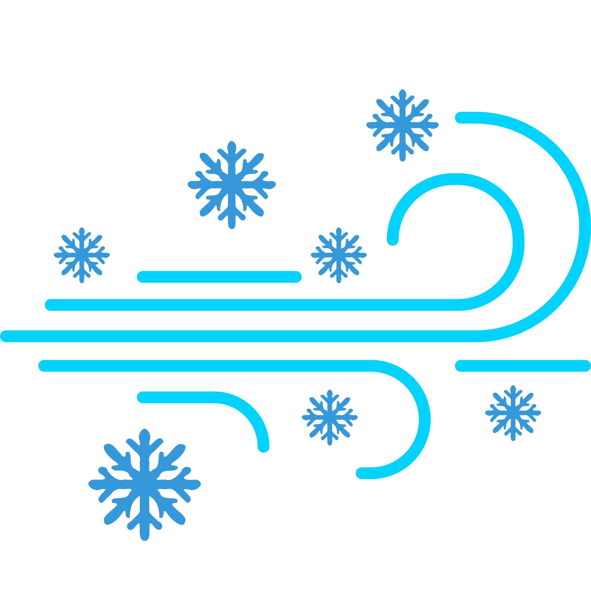
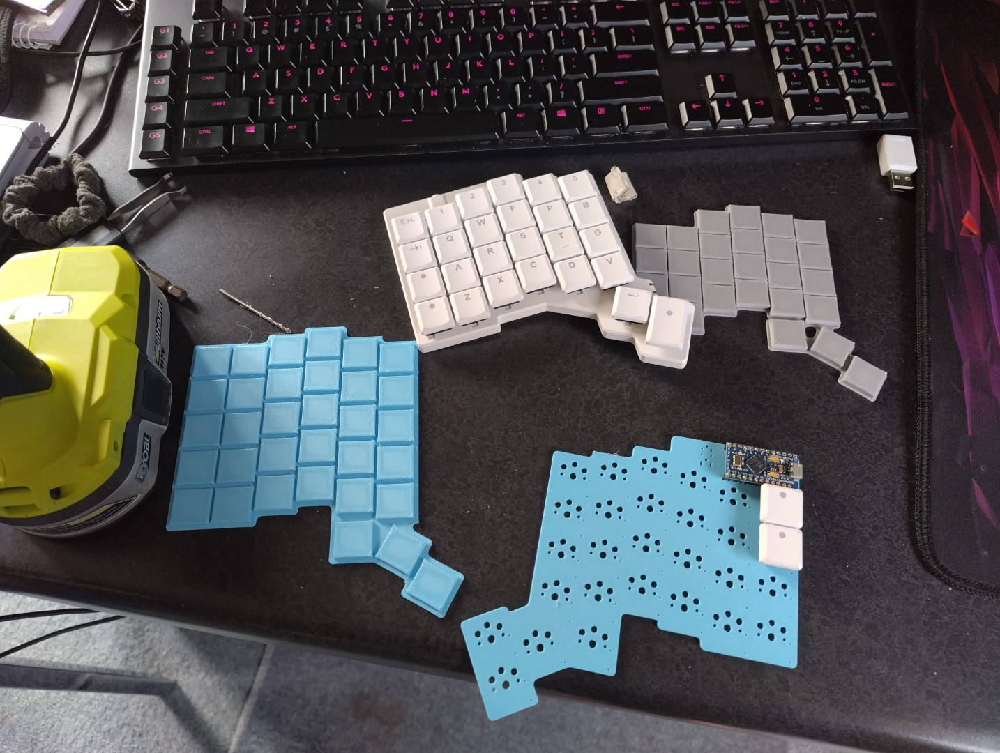
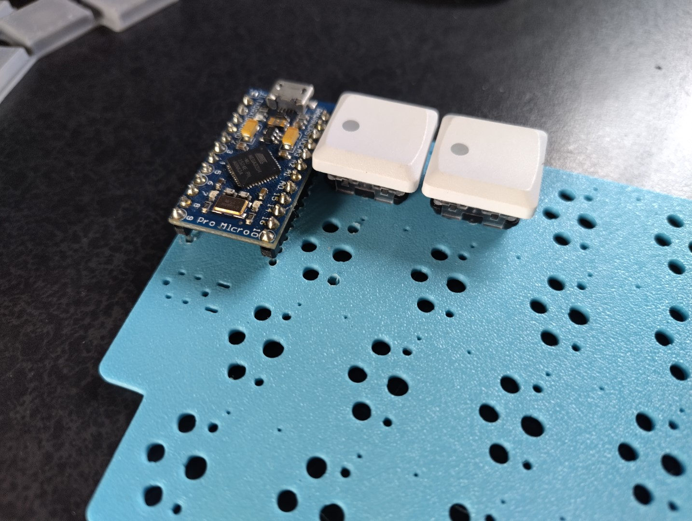
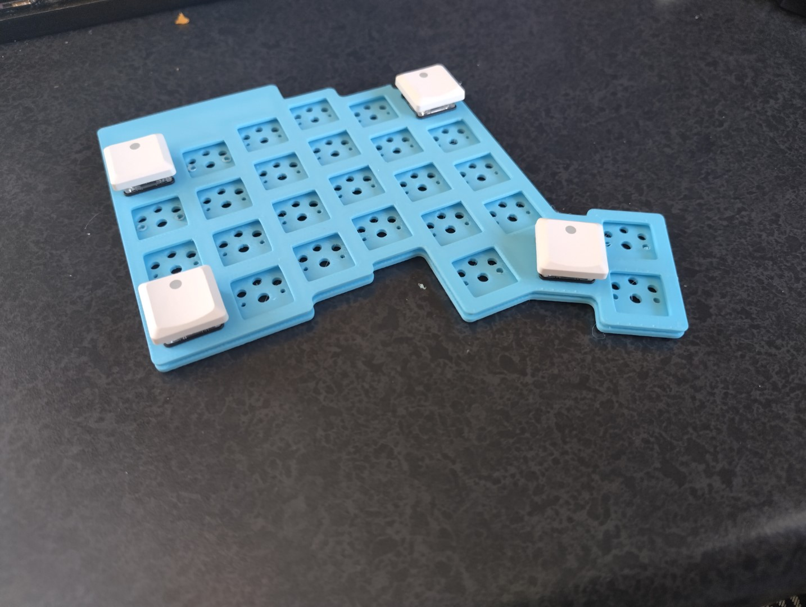
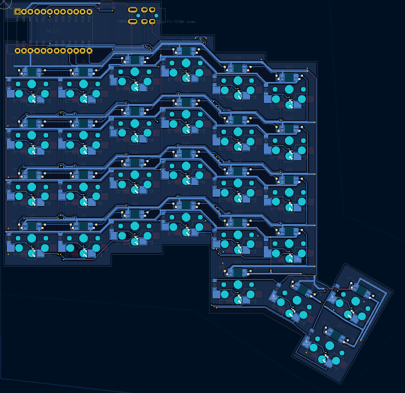
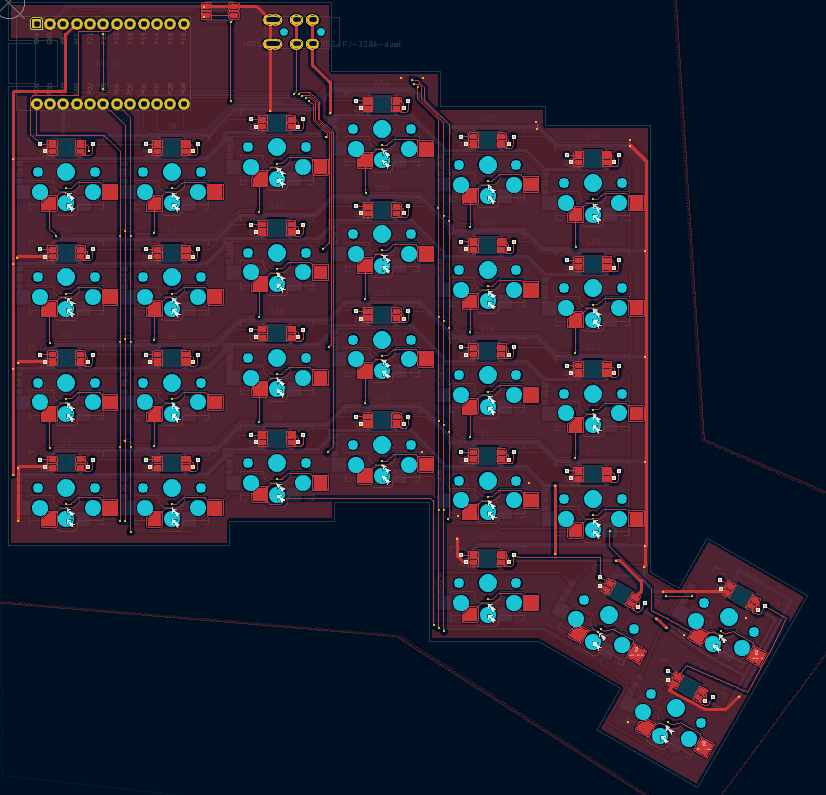
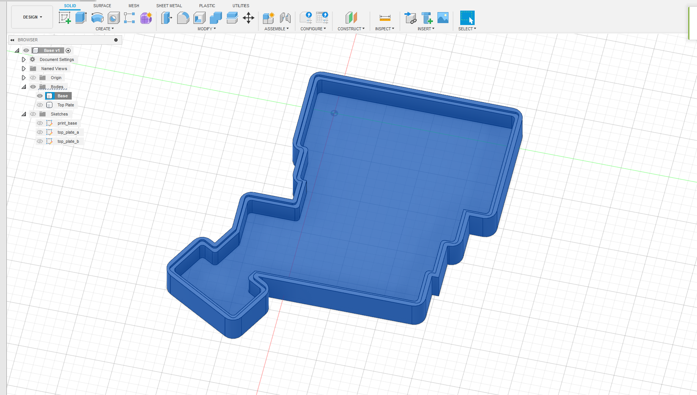
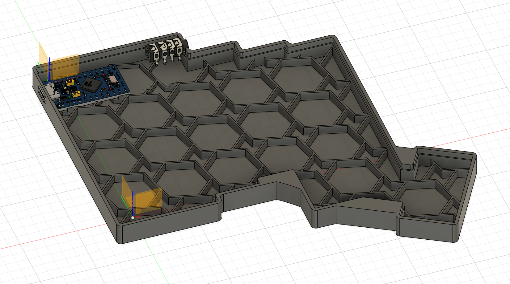
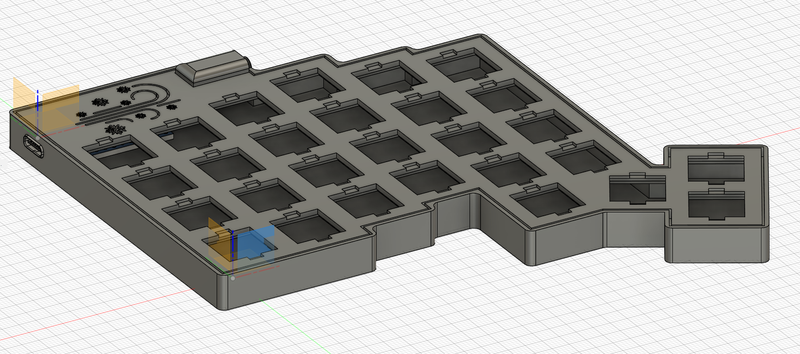

# The Southerly Breeze Split Keeb

**Brrrr is it cold down here in New Zealand winters!**

## Intro

In 2024 I was getting some serious wrist pain issues from typing all day at my job as a programmer, so I ventured into the world of split keyboards.
Initially I was just curious, but as time went on I wondered *why do we use a silly straight keyboard format*. This quickly turned into a purchase of my first split keyboard, the [ZSA Voyager](https://www.zsa.io/voyager). I quickly fell in love with the keyboard and how it felt with my hands.
Alongside also purchasing a Logitech MX Ergo trackball mouse.

I had quite a tough learning experience to switching to the Voyager strictly due to the fact that whilst I changed keyboard layouts, I switched from traditional mice to trackball mice, **and** started learning the ColemakDH keyboard layout.
Because you know what, *why do we also use a really inefficient form for typing*. Boy howdy was I in for a learning experience.

Switching to the new layer system, getting rid of the numpad, F-keys, moving spaces, tabs and enters; whilst incredibly fun, was quite intensive switch over.
But now sitting here a few months after my mission to improve desk ergonomics; I'm feeling a hell of a lot better with all my pain, voila, gone!

## Layout Printouts/Design - ErgoGen

I came across ErgoGen when researching about split keyboards, this piece of software is marvelous... complex but marvelous.
It took me quite a while to figure out how to use ErgoGen and their official docs are still a WIP meaning I was initially going blind with this software.

I came across this youtube video [ErgoGen Tutorial](https://www.youtube.com/watch?v=7UXsD7nSfDY) which dramatically helped me start with the design of my keyboard
Another great guide I came across was this one, which in my honest opinion, **is the best ErgoGen doc set I have found to date**; [ErgoGen Full Guide](https://flatfootfox.com/ergogen-part1-units-points/)

As an initial design process I decided to create a few models, drill holes and try them out on my fingers.
I enjoyed my Voyager's layout and so I wanted to mimic this layout as close as possible.
Some neat additions I added was the use of two additional thumb keys.

There was going to be three layers to the case design which I'll get into later. But the brief is a bottom plate which becomes the surrounding case, a top plate which sits just under the switches (they click into the top layer) and the circuit board which will be centered below the top layer by a few millimeters.

### Prototyping

## PCB Design - KiCad

The PCB design was fairly straightforward running the horizontal traces on one layer and vertical traces on the other, with an addition of two ground planes and thicker VCC/GND traces. The only annoying thing was that KiCad, for the life of me, doesn't support angle snapping at strange angles; and my thumb cluster is on a 30° angle. Making the thumb cluster super messy. Sigh...

The RGB data in and data out connectors were not a part of the schematic so I had to use a third party plugin to help me modify the web and attach the string of LED's to one of the PCB's pinouts. [WireIt](https://github.com/devbisme/WireIt)

After designing the PCB I shipped the Gerber off to JLCPBC to print off for me.

> **Note:** I decided to create a left handed and right handed version of the PCB board rather than trying to remodel the case for when the PB is flipped. It wasn't very hard to rewire the board to accommodate a flipped MCU in the design.

### 3D Board View

### PCB Underside

### PCB Topside

## Case Design - AutoDesk Fusion

Whilst ErgoGen can and does generate most 3D print designs and DXF files, I found it quite fiddly changing the YAML constantly to design a case.

So instead I decided that the best course was to get a rough outline in ErgoGen, then work the rest of the design in AutoDesk. The ErgoGen created some annoying fillets in the output, so I removed those and re-created the fillets to clean up the design.

This was fairly straightforward as I just imported the base board, and two top layers into AutoDesk and did the following:

> **Note:** I created a key cap puller hole and labeled that as outline_inner_upper to aid in hot-swapping of choc switches

The case can be mirrored very easily when printing in BambooLab so I didn't bother doing the mirroring inside AutoDesk.

### Top Plate

1. Make three top plates, one with keycap puller cutouts
2. One without modification
3. One slightly thinner than the switch holes
4. Add logo on top of the top plate
5. Add TRRS cover

### Case

1. Outline the base
2. Extrude base to height of board and run a shell on the object
3. Use the top plate to create an indent for the top plate to sit in
4. Create a USB-C cutout
5. Create a TRRS cutout
6. Create a ribbed section on the bottom for support

### Combined Output

## Components

| Components | ID | Links | Total Cost (NZD) | Quantity | Notes |
| ---------- | -- | ----- | ---------- | -------- | ----- |
| Choc V1 Keycaps | | [Tai-Hao Thins](https://shop.tai-hao.com/products/white-1) | $96.67 | | Same key caps as ZSA Voyager |
| Choc V1 Switches | | [Ambient Silent Twilight/Nocturnal](https://keebd.com/en-nz/products/ambients-silent-linear-twilight-choc-switches?_pos=2&_fid=9a770a5f9&_ss=c) | $108 | 60 |
| Kailh Hotswap Sockets | | [Choc Hotswap Sockets](https://keebd.com/en-nz/products/kailh-choc-hotswap-sockets?_pos=1&_psq=hotswap&_ss=e&_v=1.0) | $24 | 60 |
| Pico Micro (USB-C) | | AliExpress | | 2 |
| Surface Mount Diodes | SOD 123 - DSF1J | [LCSC](https://www.lcsc.com/product-detail/Fast-Recovery-High-Efficiency-Diodes_FUXINSEMI-DSF1J_C915615.html) | $1.58 | 200 |
| RGB | led_sk6812mini-e | [LCSC](https://www.lcsc.com/product-detail/RGB-LEDs-Built-in-IC_OPSCO-Optoelectronics-SK6812MINI-E_C5149201.html) | $7.15 | 100 |
| Surface Mount Reset Button | EVQPUA02K | [LCSC](https://www.lcsc.com/product-detail/Tactile-Switches_PANASONIC-EVQPUA02K_C128539.html) | $1.62 | 5 |
| TRRS Connector | PJ-320A | [LCSC](https://www.lcsc.com/product-detail/Audio-Connectors_XKB-Connectivity-PJ-320AG-B_C2884984.html) | $0.39 | 5 |
| TRRS Cable | UGreen 10732 | [LCSC](https://www.lcsc.com/product-detail/Audio-cable_UGREEN-10732_C3014968.html) | $5.06 | 5 |
| Circuit Board | | [JLCPCB](https://jlcpcb.com/) | $11.76 | 5 |

## Improvements & Considerations

- Next time instead of using a Pro Micro, I will use a MEGA32U4 directly on the board and design the components directly into the board.
  > This will cleanup the USB-C port location and make the reversible board work correctly without having to re-design the PCB case for the mirrored side.

...